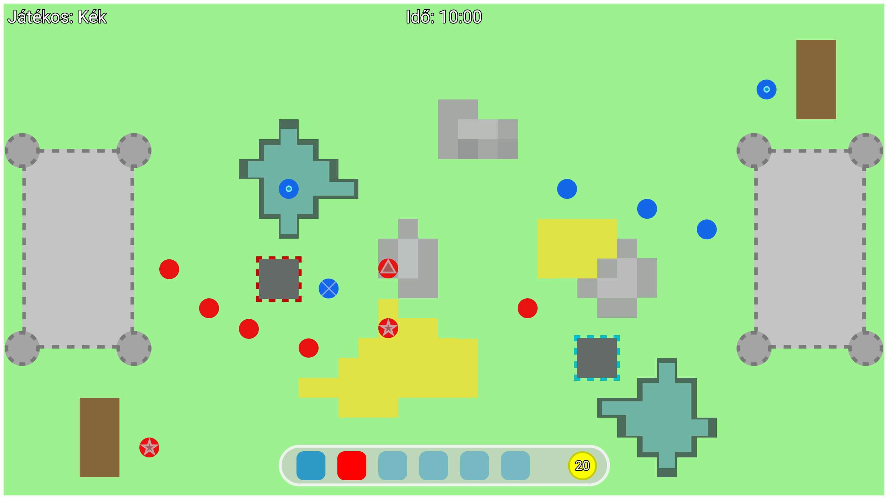

# Double Trouble Kingdom

## Bevezetés
A Double Trouble Kingdom kétszemélyes, egy gépen játszható stratégiai játék.
Egy 2D-s felülnézetes, négyzetrácsos pályán zajlik le.\
A játék körökre van osztva, körönként mindkét játékos tud építkezni, majd támadni.
A támadás először csak zsoldos alapkatonákkal történhet, majd később \
lehet speciális egységeket is képezni.
A két játékos egy-egy kastéllyal rendelkezik, a játék célja az ellenfél kastélyának ledöntése. \
Védekezésképpen a játékosok tornyokat építhetnek, melyekben akár íjászok tüzelhetnek az ellenfél támadó katonáira. \
A katonák célba vehetik a tornyokat és a kastélyokat is.
A kastélyok, épületek és katonák életerőponttokkal rendelkeznek.

### Épületek fajtái:
- Barakk - Fejlettebb katonák kiképzésére szolgál.
- Torony - Védekezés a katonák ellen egy adott átmérőn belül.

A tornyokat aranyért 3 szintig fejleszteni lehet.
- Első szint - Akadály az átkelésben.
- Második szint - Íjászok helyezése a toronyba.
- Harmadik szint - Nagyobb terület sebzése tüzes nyilakkal.

A tornyok nem használhatók az átkelés lehetetlenítésére.
A ledöntött tornyok helyére új torony csak a romok eltakarítása után építhető.

### Barakkok építésével többféle katonát is lehet képezni:
- Kamikaze - Felrobbantja magát a tornyok közelében, ezzel területi sebzést okoz és 25% eséllyel lerombolja a tornyokat.
- Hegymászó - Át tud kelni a hegyes területeken is, de a többi területen lassabb.
- Kétéltű - Át tud kelni a mocsaras, vizes területeken is, de a többi területen lassabb.
- Bérgyilkos - Megtámadja az előtte lévő ellenséges katonákat.

### A pálya felépítése
A pálya két oldalán elhelyezkedő kastélyok közötti átkelést különböző terepakadályok nehezítik meg:
- Rét - Normál sebességen haladnak a katonák.
- Sivatag - Lassabban haladnak a katonák.
- Hegység - Nem lehet rá építeni, csak hegymászók kelhetnek át rajta.
- Mocsár - Nem lehet rá építeni, csak kétéltűek kelhetnek át rajta.

### Arany szerzése
Az építkezés és a katonák indítása, kiképzése aranyba kerül. \
Mindkét játékos egy kezdő mennyiségű arannyal indul, ezentúl az életben \
lévő katonáinak arányában szerezhez többet tornyok ledöntésével és katonák megölésével.

### A játek vége
A játék akkor ér véget, amikor egy játékos kastélya illetve összes életben lévő katonája elveszti az életerőpontját. \
Ha egy játékos elveszti a kastélyát, nem vásárolhat többet a játék során. \
Amennyiben az életben maradt katonáinak sikerült lerombolni az ellenséges kastélyt, a játék döntentlennel ér véget.

### Drótvázterv

